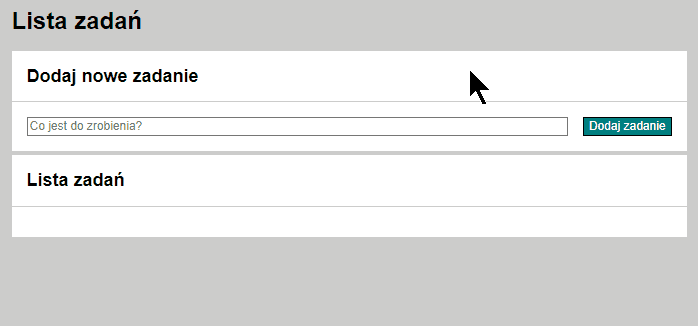

# To-Do-List

## Demo: https://jacekdu.github.io/To-Do-List/

## Description:

Example of 'To Do List'. 

## Features:

1. Dynamically built task list.
2. Ability to mark a completed task by check mark.
3. Ability to delete from the list any task (completed or not).
4. The html code is rendering from beginning after any action on the page.

## Tools Utilised:

- HTML - Living Standard,
- CSS,
- Javascript,
- BEM convention,
- Normalise.css
- Open Graph Protocol
- GIF - [ScreenToGif](https://www.screentogif.com/)
